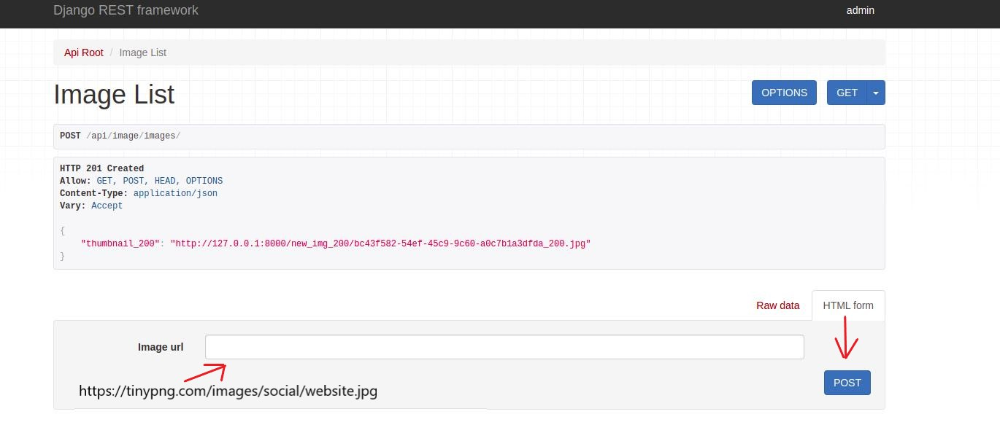
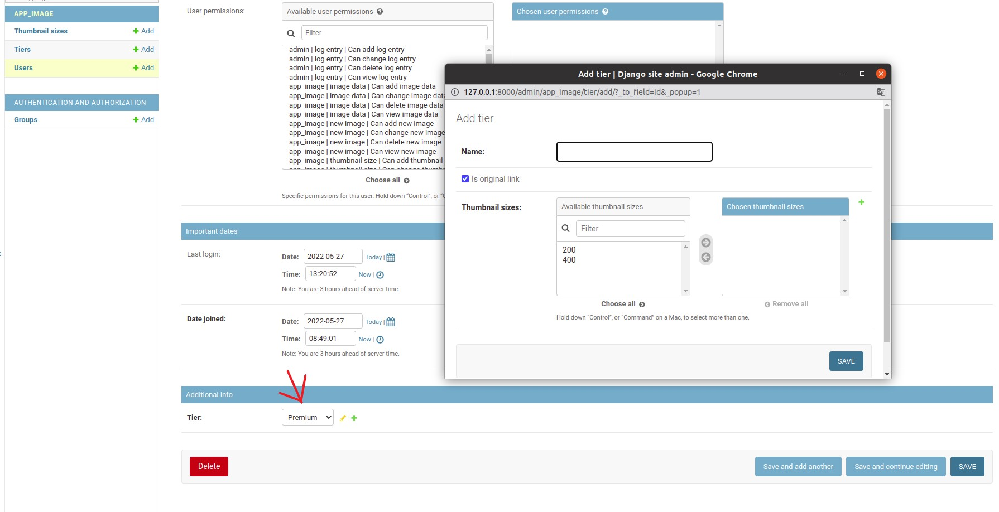
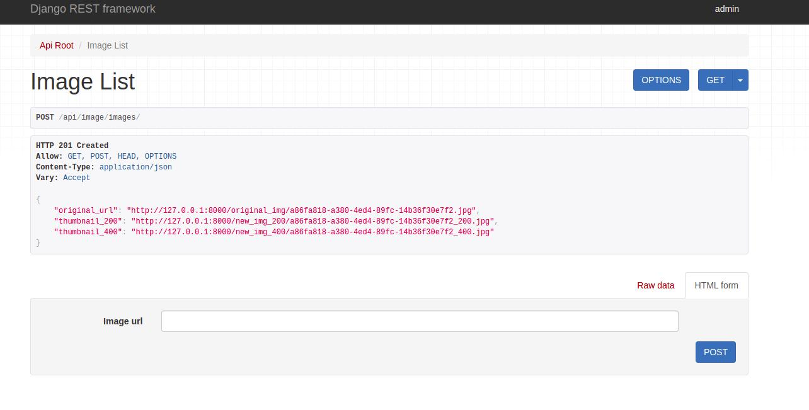

# Api for images

Simple API that allows user to upload an image in JPG format.

## Installation

* Python3 must be already installed
* Docker must be already installed 
* Docker-compose must be already installed

```shell
git clone https://github.com/Nazar-kob/image_api.git
cd image_api
docker-compose up -d --build
```
##### After you must be logged in

### Access
 * Username: admin
 * password: 12345


[Click here to login](http://127.0.0.1:8000/admin/.)
##### Okay, let's open the API 
[Click here to open the API](http://127.0.0.1:8000/api/image/images/)

```
https://helpx.adobe.com/content/dam/help/en/photoshop/using/convert-color-image-black-white/jcr_content/main-pars/before_and_after/image-before/Landscape-Color.jpg
```
```
https://tinypng.com/images/social/website.jpg
```
```
https://images.ctfassets.net/hrltx12pl8hq/7yQR5uJhwEkRfjwMFJ7bUK/dc52a0913e8ff8b5c276177890eb0129/offset_comp_772626-opt.jpg
```

##### Copy one of these URLs, paste it into this form, and click POST. Then you should see the data as in the picture below.

##### However, you can change your plan or create a personal one and choose any size in admin-django as in the picture below.

##### So I just changed the plan to "Enterprise", put a new link there and, as you can see in the picture below, data become more.


## Note
I did not use PostgreSQL. I just want to show you how it works